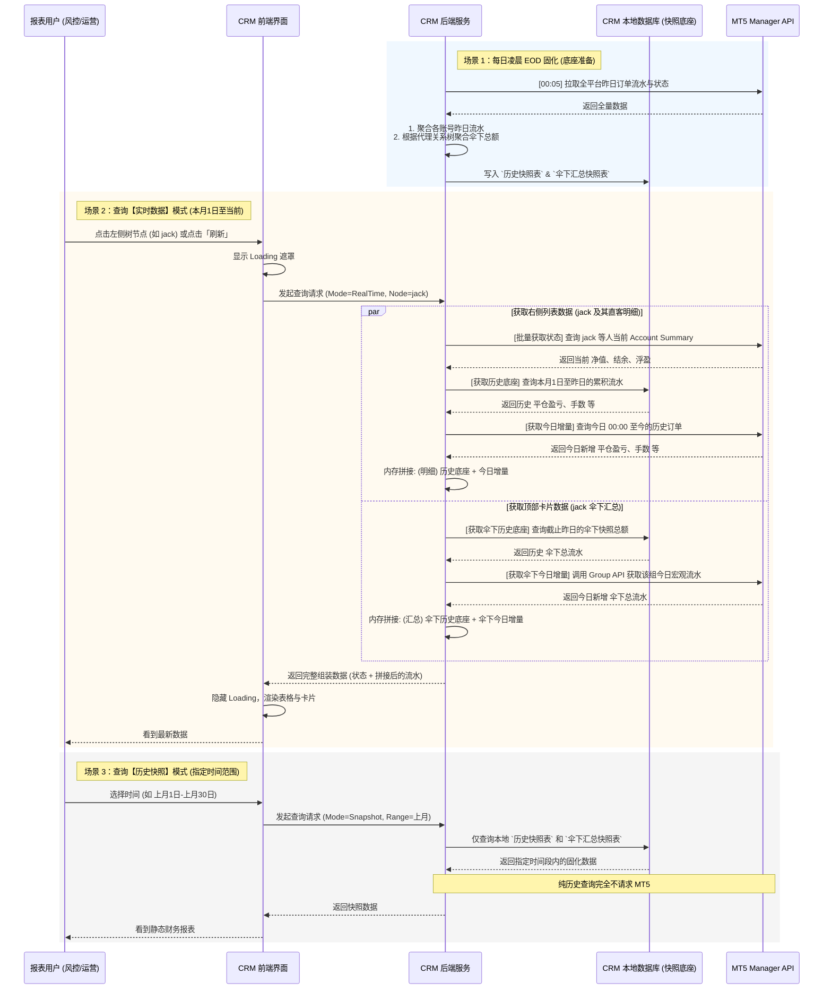

# 风控报表数据获取流程图 (按需穿透式聚合)

```mermaid
sequenceDiagram
    participant User as 报表用户 (风控/运营)
    participant UI as CRM 前端界面
    participant API as CRM 后端服务
    participant DB as CRM 本地数据库 (快照底座)
    participant MT5 as MT5 Manager API

    %% 场景 1：EOD 定时任务 (每日凌晨)
    rect rgb(240, 248, 255)
        note right of API: 场景 1：每日凌晨 EOD 固化 (底座准备)
        API->>MT5: [00:05] 拉取全平台昨日订单流水与状态
        MT5-->>API: 返回全量数据
        API->>API: 1. 聚合各账号昨日流水<br/>2. 根据代理关系树聚合伞下总额
        API->>DB: 写入 `历史快照表` & `伞下汇总快照表`
    end

    %% 场景 2：用户查询实时数据
    rect rgb(255, 250, 240)
        note right of User: 场景 2：查询【实时数据】模式 (本月1日至当前)
        User->>UI: 点击左侧树节点 (如 jack) 或点击「刷新」
        UI->>UI: 显示 Loading 遮罩
        UI->>API: 发起查询请求 (Mode=RealTime, Node=jack)
        
        par 获取右侧列表数据 (jack 及其直客明细)
            API->>MT5: [批量获取状态] 查询 jack 等人当前 Account Summary
            MT5-->>API: 返回当前 净值、结余、浮盈
            
            API->>DB: [获取历史底座] 查询本月1日至昨日的累积流水
            DB-->>API: 返回历史 平仓盈亏、手数 等
            
            API->>MT5: [获取今日增量] 查询今日 00:00 至今的历史订单
            MT5-->>API: 返回今日新增 平仓盈亏、手数 等
            
            API->>API: 内存拼接: (明细) 历史底座 + 今日增量
        and 获取顶部卡片数据 (jack 伞下汇总)
            API->>DB: [获取伞下历史底座] 查询截止昨日的伞下快照总额
            DB-->>API: 返回历史 伞下总流水
            
            API->>MT5: [获取伞下今日增量] 调用 Group API 获取该组今日宏观流水
            MT5-->>API: 返回今日新增 伞下总流水
            
            API->>API: 内存拼接: (汇总) 伞下历史底座 + 伞下今日增量
        end
        
        API-->>UI: 返回完整组装数据 (状态 + 拼接后的流水)
        UI->>UI: 隐藏 Loading，渲染表格与卡片
        UI-->>User: 看到最新数据
    end

    %% 场景 3：用户查询历史快照
    rect rgb(245, 245, 245)
        note right of User: 场景 3：查询【历史快照】模式 (指定时间范围)
        User->>UI: 选择时间 (如 上月1日-上月30日)
        UI->>API: 发起查询请求 (Mode=Snapshot, Range=上月)
        
        API->>DB: 仅查询本地 `历史快照表` 和 `伞下汇总快照表`
        DB-->>API: 返回指定时间段内的固化数据
        note over API,MT5: 纯历史查询完全不请求 MT5
        
        API-->>UI: 返回快照数据
        UI-->>User: 看到静态财务报表
    end
```